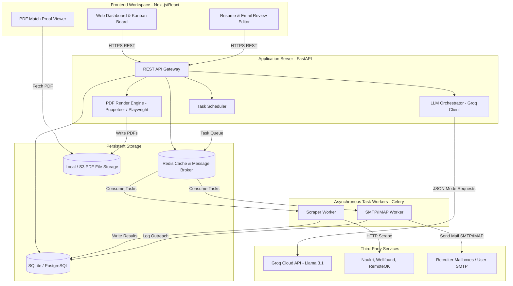
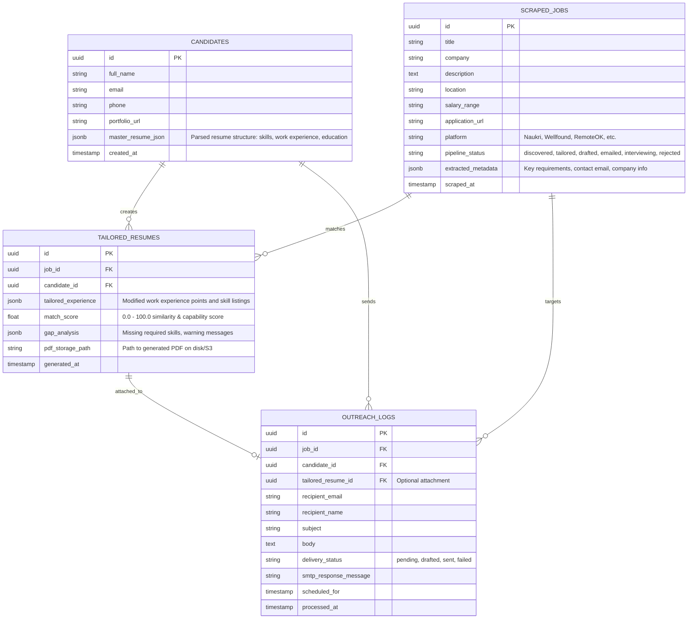
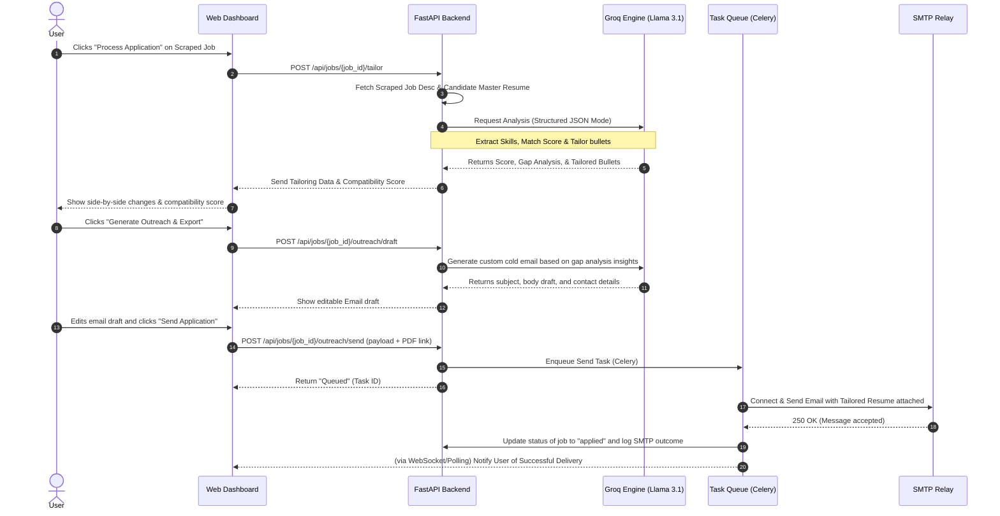

# System Architecture: Unified CareerAgent Suite

This document outlines the detailed system architecture for the unified **CareerAgent Suite**, combining [Job Agent](https://github.com/Mahin499/Job-agent), [Resume Shapeshifter](https://github.com/Mahin499/Resume-Builder-Project), and [The Closer Email Bot](https://github.com/Mahin499/Email-Sending-Bot) into a single, cohesive, end-to-end platform.

---

## 1. System Topology

The platform follows a decoupled **Single-Page Application (SPA)** and **RESTful micro-backend** architecture to support Next.js frontend state management alongside Python's robust ecosystem for web scraping and data processing.



---

## 2. Database Schema Design

We use a relational database layout (e.g., SQLite for local development, PostgreSQL for production) to maintain state and full traceability from job discovery to final outreach.



---

## 3. Core API Endpoint Specifications

The FastAPI gateway manages communication, offloading heavy processing to Redis/Celery queue networks.

### 3.1. Scraper Control Group
*   `POST /api/scraper/start`
    *   **Description**: Starts a background scrape task.
    *   **Payload**:
        ```json
        {
          "job_titles": ["Python Developer", "React Engineer"],
          "locations": ["Remote", "Bangalore"],
          "max_results_per_platform": 50
        }
        ```
    *   **Response**: `202 Accepted` with a `task_id` for status polling.
*   `GET /api/scraper/status/{task_id}`
    *   **Description**: Fetches background task progress.
    *   **Response**: `{"task_id": "...", "status": "processing", "progress": 45}`
*   `GET /api/jobs`
    *   **Description**: Queries scraped job listings with filtering capabilities.
    *   **Query Params**: `status`, `company`, `platform`, `limit`, `offset`.

### 3.2. Resume Tailoring & Matching Group
*   `POST /api/jobs/{job_id}/tailor`
    *   **Description**: Extracts job information, scores it against the master resume, and generates tailored resume bullet points.
    *   **Response**:
        ```json
        {
          "match_score": 78.4,
          "gap_analysis": {
            "missing_required_skills": ["Kubernetes", "Redis"],
            "missing_preferred_skills": ["Golang"],
            "action_items": ["Prepare to speak about container experience in interview."]
          },
          "tailored_points": [
            {
              "company": "Prior Tech Inc",
              "original_bullet": "Developed API backends in Flask",
              "recommended_bullet": "Architected high-throughput REST APIs using Flask, scaling database reads via Redis integration.",
              "reason": "Aligns with database scaling mentions in job description.",
              "safety_risk": "low"
            }
          ]
        }
        ```
*   `POST /api/jobs/{job_id}/export-pdf`
    *   **Description**: Generates and compiles the PDF resume using headless Chrome/Puppeteer.
    *   **Payload**: The tailored JSON structure.
    *   **Response**: `200 OK` with binary octet-stream (PDF file) or a download URL.

### 3.3. Outreach Group
*   `POST /api/jobs/{job_id}/outreach/draft`
    *   **Description**: Personalizes an email draft targeting the recruiter of a specific job.
    *   **Response**:
        ```json
        {
          "recipient_email": "recruiter@targetcompany.com",
          "subject": "Application: Frontend Engineer - [Candidate Name]",
          "body": "Hi [Recruiter Name]...\n\nI noticed you are hiring...",
          "warnings": [
            {"type": "word_count", "message": "Email exceeds 150 words (currently 162)."}
          ]
        }
        ```
*   `POST /api/jobs/{job_id}/outreach/send`
    *   **Description**: Queues the email to be sent out immediately or saved as a draft on IMAP.
    *   **Payload**:
        ```json
        {
          "subject": "...",
          "body": "...",
          "recipient_email": "...",
          "action": "send_smtp" // or "save_imap_draft"
        }
        ```
    *   **Response**: `200 OK` with delivery status logs.

---

## 4. Key Data Flow Pipelines

### 4.1. The One-Click Application Pipeline
This diagram traces how a user moves a job listing from "Scraped" to "Applied" inside the unified system workspace.



---

## 5. LLM Integration Strategy (Structured JSON Broker)

To ensure consistency, Groq Cloud API calls use **Llama-3.1-70b-Versatile** or **Llama-3.1-8b-Instant** running in strict JSON Mode.

### 5.1. Prompt Engineering: Resume Tailoring
```text
System Prompt:
You are an expert resume reviewer. Compare the candidate's experience bullets with the provided job description.
Your goal is to rephrase the experience bullets to highlight relevant transferrable skills using similar terminology found in the job description.
Do NOT fabricate metrics, projects, or credentials.
You MUST output a JSON object containing:
{
  "match_score": float,
  "gap_analysis": {
    "missing_required_skills": [string],
    "missing_preferred_skills": [string],
    "action_items": [string]
  },
  "tailored_points": [
    {
      "company": string,
      "original_bullet": string,
      "recommended_bullet": string,
      "reason": string,
      "safety_risk": "low" | "medium" | "high"
    }
  ]
}
```

### 5.2. Prompt Engineering: Cold Outreach Email Generation
```text
System Prompt:
You are a career consultant writing a cold email on behalf of a candidate applying to a company.
Analyze the job requirements, company background, and the candidate's compatibility data.
Write an outreach email that is concise (<150 words), conversational, features a single call-to-action, and references specific projects from the candidate's tailored resume that match the company's stack.
Do not make the email sound generic. Output JSON matching the format:
{
  "recipient_email": string,
  "recipient_name": string,
  "subject": string,
  "body": string
}
```

---

## 6. Security & Infrastructure Configuration

1.  **Credential Encrypted Vault**:
    *   SMTP Server login keys, App Passwords, and Groq API keys are stored in environment variables (`.env`).
    *   For multi-user scalability, candidate SMTP credentials should be stored in the database, encrypted using **AES-256-GCM** with a master key stored in the server's environment configuration.
2.  **Anti-Spam Rate Limits (The Closer Engine)**:
    *   The worker enforces a strict cooldown period (e.g., 60-120 seconds) between outgoing SMTP requests.
    *   Each recipient email has a unique lock in Redis for 30 days. Any new outreach attempt targeting that address is blocked, prompting an alert on the UI dashboard.
3.  **PDF Rendering Security**:
    *   Headless Puppeteer is run inside sandboxed environments with `--disable-gpu` and `--no-sandbox` limits, rendering local CSS print styles directly from Next.js endpoints.
