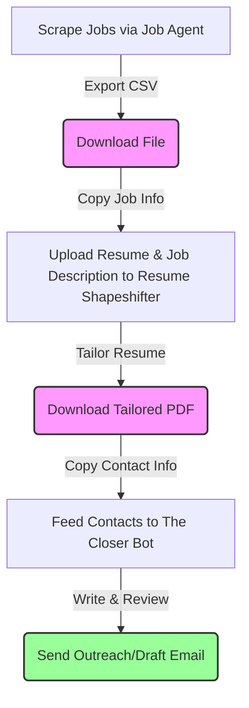
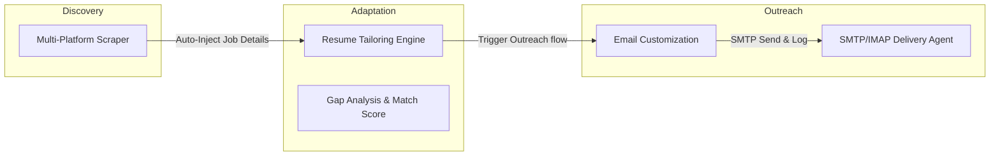

# Unified AI-Driven Career Suite: Problem Statement & Vision

## 1. Background
Job seeking and professional outreach are currently fragmented processes. Candidates typically navigate three distinct, disconnected stages:
1. **Job Discovery**: Manually searching and scraping listings across multiple platforms (e.g., Naukri, Wellfound, RemoteOK).
2. **Resume Customization**: Manually tweaking resumes (PDF/Word docs) to align with specific job descriptions without fabricating credentials or qualifications.
3. **Outreach & Communication**: Draft cold emails, keep track of who was contacted, prevent duplicate emails, and ensure quality control (e.g., length, call-to-actions, tone).

To address these pain points, three independent utilities were built:
*   [Job Agent](https://github.com/Mahin499/Job-agent): An automated Python scraper that aggregates listings from platforms like Naukri, RemoteOK, and Wellfound, exporting them to CSV.
*   [Resume Shapeshifter](https://github.com/Mahin499/Resume-Builder-Project): A Next.js Web App that parses resumes, analyzes job descriptions, scores compatibility (0-100), offers truth-aligned rephrasing recommendations, and exports tailored PDFs.
*   [The Closer Email Bot](https://github.com/Mahin499/Email-Sending-Bot): A Python CLI and Streamlit dashboard that takes target contacts, leverages Llama-3.1 via Groq to write personalized outreach emails, applies safety guardrails, and sends/drafts them via SMTP/IMAP with deduplication.

---

## 2. The Core Problem
While each tool is effective individually, using them in isolation creates a **high-friction, disjointed user experience**:

### Key Issues:
1.  **Manual Data Bridges**: Candidates must manually copy scraped job descriptions, companies, and contact details from the scraper outputs into the Resume Builder, and then move email contacts into the Email Bot.
2.  **No Central State / Progress Tracking**: There is no single source of truth. Users cannot see which jobs they scraped, which resumes they tailored for those jobs, and whether they have successfully sent an email to the recruiter for that specific listing.
3.  **Fragmented Tech Stacks**:
    *   **Frontend**: Next.js (React) for the resume builder vs. Streamlit/CLI for the email bot.
    *   **Backend**: Node.js/Groq API for the resume builder vs. Python/Groq API for the email bot and job scraper.
4.  **Inefficient LLM Usage**: Job analysis is done multiple times (once for resume tailoring, once for email personalization), resulting in redundant API calls and higher token costs.

---

## 3. The Solution: Unified Career Portal
We propose building a **Unified AI-Driven Career Pipeline** (codenamed **CareerAgent Suite**) that merges all three projects into a single, cohesive, end-to-end web platform.

### Proposed High-Level Platform Architecture

1.  **Unified Frontend (Next.js & React)**:
    *   A premium, responsive, dark-themed dashboard.
    *   **Scraper Control Center**: Form to input target job titles and locations, triggering scraping tasks and viewing results in a rich interactive table.
    *   **Job Pipeline Board (Kanban style)**: Discovered -> Resume Tailored -> Email Drafted -> Emailed -> Interviewing.
    *   **Interactive Workspace**: Side-by-side view showing the selected Job Description, Resume Match Score, Gap Analysis, Tailoring Recommendations, and the AI-generated Outreach Email draft.
2.  **Unified Python Backend (FastAPI / FastAPI-Celery)**:
    *   Since the Scraper and the Email Bot are Python-based, a FastAPI backend is optimal for running these processes.
    *   Uses Celery/Redis for background job scraping and batch email drafting tasks.
    *   Integrates with SQLite/PostgreSQL for persistent storage of candidate profiles, scraped jobs, tailored resumes, and outreach logs.
3.  **Unified Data Schema**:
    *   Every scraped job gets a unique identifier.
    *   Every tailored resume and generated email is linked back to that specific job ID, establishing full traceability.
4.  **Consolidated LLM Broker**:
    *   A single backend broker handles Groq Cloud API calls.
    *   Analyzes the job description *once* to extract skills, requirements, company insights, and tone guides, caching this payload to tailor both the resume and write the email, reducing API costs by ~40%.

---

## 4. Key Integration Workflows

### Workflow A: One-Click Pipeline
1.  User starts a scrape task for "Frontend Engineer".
2.  Discovered jobs appear on the dashboard.
3.  User clicks **"Process Application"** on a listing:
    *   The platform automatically extracts the job requirements.
    *   Scores the user's primary profile/resume against it.
    *   Generates tailored experience bullet points.
    *   Drafts a cold email to the listed recruiter/contact.
4.  User reviews the side-by-side resume differences and email draft, makes adjustments, and clicks **"Finalize Application"**:
    *   Tailored PDF is compiled and saved.
    *   Email is sent via SMTP or appended to Gmail Drafts (with the tailored PDF attached).
    *   Status is updated to "Applied" with log records.

### Workflow B: Safeguards & Anti-Spam
*   **Company Deduplication**: If a scraped job belongs to a company already contacted within the last 30 days, the platform alerts the user to prevent duplicate spamming.
*   **Outreach Warnings**: Heuristics check email draft parameters (e.g., word count, call-to-actions, attachment sizes) before allowing final submission.

---

## 5. Implementation Roadmap

### Phase 1: Database & API Foundation (Python Backend)
*   Define standard database models for `Jobs`, `CandidateProfiles`, `TailoredResumes`, and `OutreachLogs`.
*   Migrate scraping logic into background tasks.
*   Expose endpoints for starting scraper jobs, querying compatibility, generating resume edits, and drafting/sending emails.

### Phase 2: Frontend Convergence (Next.js Dashboard)
*   Design a unified UI workspace that embeds the Resume Builder workspace, Scraper results, and Email Editor.
*   Implement state management to link the active resume version and active email draft to the selected job listing.

### Phase 3: Automation & Hooking
*   Implement background worker tasks for asynchronous document PDF creation (Puppeteer/WeasyPrint) and email transmission.
*   Add tracking for email delivery statuses (SMTP response codes, IMAP synchronization).
